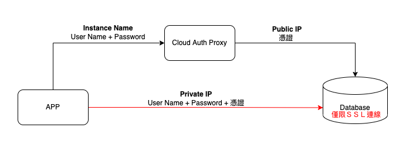
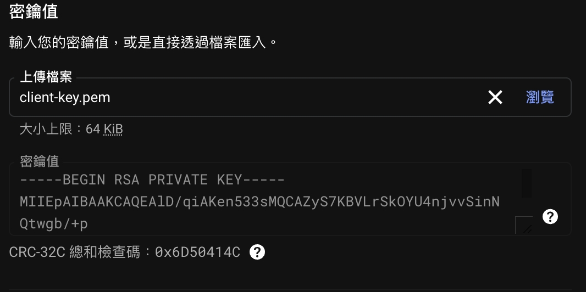
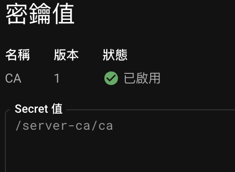
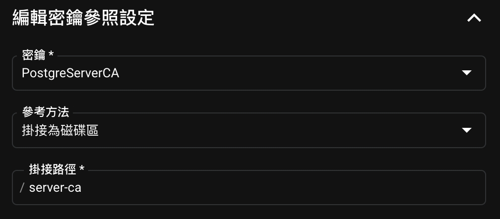
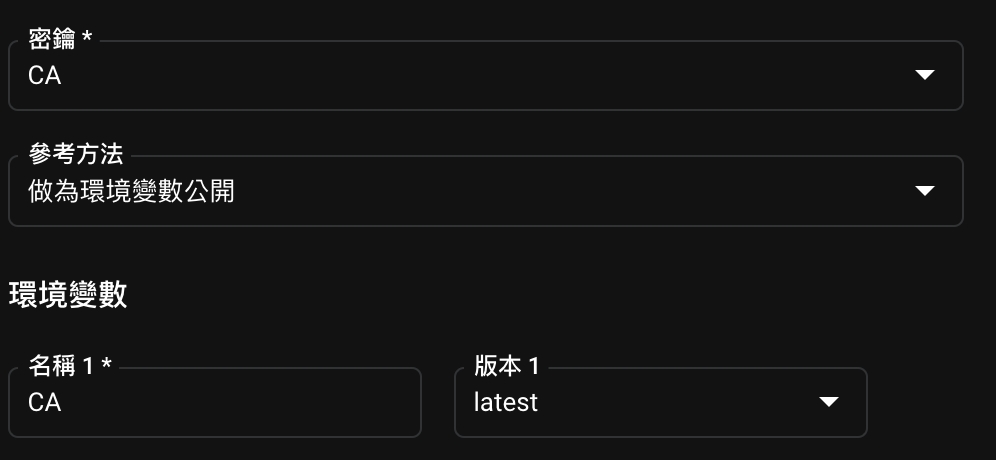

# Private IP Connection

### 說明
使用 Private IP ＋ 憑證直連資料庫

### 安裝套件
 - sqlalchemy
 - pg8000

### 前置作業
 - 設定 VPC

### 資料庫設定
- 關閉 Public IP
- 開啟 Private IP：設定 VPC
- 開啟 僅允許ＳＳＬ連線
- 產生憑證 （並下載備用）

### Cloud Run 設定
- 掛入要連線的資料庫
- 設定vpc (同資料庫設定)



### Secret Manager 設定
> 上傳pem檔

<br/><br/>
設定讀取路徑

<br/><br/>
> ### Cloud Run 讀取 Secret
> 指定 secret 磁區

<br/><br/>
設定讀取路徑

> ### 程式碼
> ```python
> db_root_cert = os.getenv("CA")  # e.g. '/path/server-ca.pem'
> ```

### 參考資料
[SqlAlchemy Samples](https://github.com/GoogleCloudPlatform/python-docs-samples/tree/main/cloud-sql/postgres/sqlalchemy) <br/>